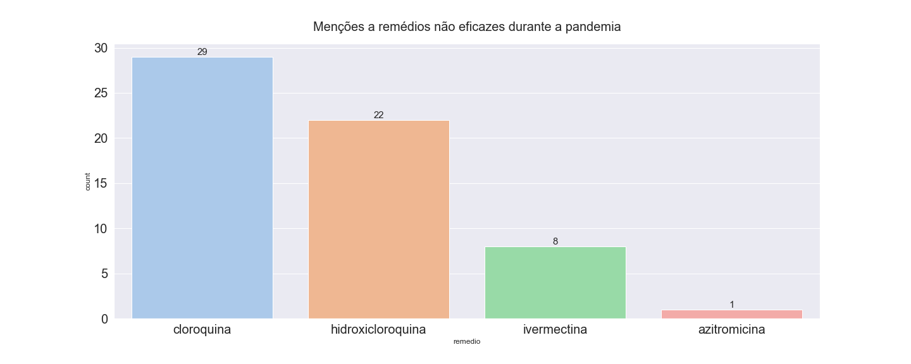
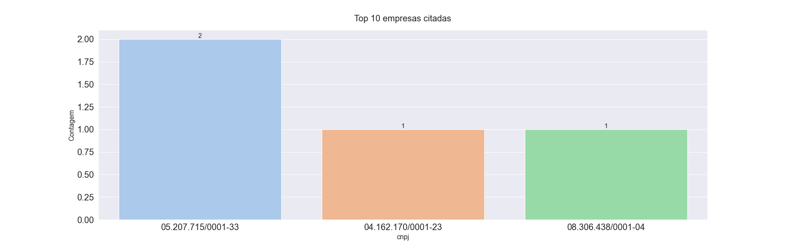

# Resumo
- **Disciplina**: IMD1151 - Ciência de Dados
- **Ano**: 2021.2
- **Professor**: [Leonardo Bezerra](https://github.com/leobezerra?tab=repositories)
- **Grupo**: Joseane Palhares de Aquino, Rafael Bezerra da Escóssia Araújo, Thereza Angélica Moura e Silva, Wagner Gama

Esse repositório é destinado ao projeto da disciplina Ciência de Dados da Universidade Federal do Rio Grande do Norte. Nesse projeto, será fiscalizado a menção a remédios não eficazes em diários oficiais de municípios brasileiros. Para essa finalidade, será utilizado as ferramentas dispostas pelo projeto [Querido Diário](https://github.com/okfn-brasil/querido-diario) da Open knowledge Brasil.

# Contextualização
De acordo com o próprio site, a Open Knowledge Brasil (OKBR), também chamada de Rede pelo Conhecimento Livre, é uma Organização da Sociedade Civil (OSC) sem fins lucrativos e apartidária, regida por estatuto. A principal missão da OKBR é desenvolver ferramentas cívicas, projetos, análises de políticas públicas, jornalismo de dados e promover o conhecimento livre nos diversos campos da sociedade. Na esfera política, a organização busca tornar a relação entre governo e sociedade mais próxima e transparente.

Em resumo, a OKBR é uma rede que desenvolve projetos, visando construir uma sociedade mais transparente e inovadora. Nessa perspectiva, um projeto da organização que ganhou grande notoriedade na mídia foi a Operação Serenata de Amor, que é um projeto aberto e colaborativo que utiliza a ciência de dados para fiscalizar os reembolsos efetuados pela Cota para o Exercício da Atividade Parlamentar (CEAP), verba que custeia alimentação, transporte, hospedagem e até despesas com cultura e assinaturas de TV dos deputados federais.

Com o sucesso dessa iniciativa, surgiu a demanda de fiscalizações que transbordem a fronteira de Brasília, que representa apenas uma fatia do orçamento público. Entretanto, ao deparar-se com as esferas municipais, infelizmente, não há muitos dados disponíveis e sem dados não é possível a fiscalização, e é nesse cenário que surge o projeto Querido Diário.

Sendo assim, o Querido Diário objetiva realizar, na esfera municipal, o mesmo que o projeto Serenata de Amor fez na esfera federal. Entretanto, atualmente, os diários oficiais são as principais fontes de informação sobre as prefeituras, encontrando-se, na maioria das vezes, em um formato não estruturado, o que dificulta a exploração das informações. Nesse cenário, o projeto Querido Diário aparece justamente para “libertar” e centralizar essas informações e torná-las mais acessíveis para fiscalização.

O funcionamento da aplicação, de forma resumida, é baseado na realização de scrapings nos sites oficiais das prefeituras e um posterior tratamento de texto.

Neste trabalho, as ferramentas do projeto Querido Diário serão utilizadas para auxiliar na fiscalização de condutas e na análise de possíveis irregularidades nos municípios do estado do Rio Grande do Norte.

# Objetivos

- Fiscalizar a atuação da pandemia nos municípios brasileiros.

## Objetivos Específicos

- Investigar menções a remédios não eficazes a covid;
- Analisar licitações mencionadas nos diários que fazem menção a remédios e vacinas não eficazes;
- Verificar qual área as empresas reportadas nas licitações trabalham.


# Coleta de Dados

O primeiro passo do projeto foi a obtenção dos diários oficiais de municípios brasileiros, foram selecionadas para esse estudo todas as capitais brasileiras, além de outras grandes cidades do país.

O grande desafio dessa primeira fase é automatizar a coleta dos diários oficiais, já que cada prefeitura tem seu próprio portal. Um caminho seria realizar a raspagem dos dados (webscraping) em cada site municipal, entretanto, isso demandaria muito tempo. Nessa perspectiva, para facilitar esse processo, o projeto querido diário já disponibiliza uma API destinada a raspagem dessas informações. A API não possui, ainda, compatibilidade com todos os municípios, entretanto, a maioria das grandes cidades já fazem parte de seu acervo.

- confira os [municípios](https://github.com/bezerraescossia/imd-data-science/blob/main/municipios.txt) incluidos nesse estudo

Para a utilização da API do querido diário foi necessário, primeiramente, a criação de um ambiente de desenvolvimento. Para isso, clonou-se o repositório do projeto [Querido Diário](https://github.com/okfn-brasil/querido-diario), e acessando o diretório pelo terminal, executou-se os comandos abaixo:

```
$ python3 -m venv .venv
$ source .venv/bin/activate
$ pip install -r data_collection/requirements-dev.txt
$ pre-commit install
```

Desse modo, foi criado o ambiente de desenvolvimento através do virtual-env, ativado e instalado todos os requisitos contidos no arquivo requirements-dev.txt.

Após a criação do ambiente virtual e sua ativação, foi executado a aplicação de webscraping para cada município listado. Para isso, foi preciso dirigir-se para o diretório data_collection e executar o seguinte comando:

```
$ scrapy crawl uf_municipio -a start_date=2020-01-01
```

substituindo-se o "uf" pela unidade federativa relativa, da mesma forma com "município". Por exemplo, para o município de Natal/RN utilizariamos a seguinte linha de código:

```
$ scrapy crawl rn_natal -a start_date=2020-01-01
```

Observe ainda que na pesquisa, filtrou-se a data de início da raspagem, ou seja, foi coletado o diário oficial de todos os municípios da lista, desde o dia 01 de Janeiro de 2020 até a data presente desse texto (01/12/2021). Realizado os scrapings, foram obtidos arquivos PDFs respectivos a cada diário oficial emitido contido no filtro aplicado. Entretanto, foi gerado uma pasta para cada dia, e por questão de organização, foi desejado concentrar todos os arquivos PDFs de um município em uma única pasta.

<p align="center">
  
</p>

Para isso, foi executado o seguinte comando no diretório:

```
find . -name '*.pdf' -exec mv -t ./pdfs {} +
```

# Transformação e Estruturação dos Dados

Como visto anteriormente, o resultado obtido até então são arquivos PDFs relativos aos diários oficiais dos municípios. Entretanto, a extensão .pdf não é a ideal para ser trabalhada. A solução seria transformar os arquivos .pdf em .txt, além de gerar um arquivo .json com os metadados do .pdf. Para esse processo, o projeto querido diário também fornece os subsídios necessários, através da biblioteca querido-diario-toolbox. Para isso, foi necessário, primeiramente, instalar a biblioteca através do gerenciador de pacotes pip:

```
$ pip install querido-diario-toolbox
```

Auxiliado pela biblioteca do querido-diario-toolbox, os seguintes passos foram realizados:

1. Transformação dos arquivos .pdf para .txt e .json;
2. Seleção dos diários oficiais que possuem a citação de remédios comprovadamente não eficazes no combate ao COVID (cloroquina, ivermectina, hidroxicloroquina e azitromicina);
3. Estruturação dos textos relevantes contidos nos arquivos .txt e .json em um arquivo .csv para futura utilização como DataFrame;
4. Substituição da coluna com os códigos dos municípios e estados do IBGE por seus respectivos nomes;
5. Remoção dos textos que não possuem as palavras "COVID", "CORONA" ou "PANDEMIA", removendo assim boa parte de textos que apesar de possuirem a citação aos remédios não explicitam sua relação ao covid;
6. Criação de coluna com os CNPJs das empresas citadas nos textos, quando houver.
<br><br>
<p align='right'><a href="https://github.com/bezerraescossia/imd-data-science/blob/main/transformation.ipynb"></a> <a href="https://github.com/bezerraescossia/imd-data-science/blob/main/data/log.csv"></a></p>

# Análise Exploratória de Dados

As seguintes questões foram levantadas para a exploração dos dados:

1. Quantas vezes cada remédio não eficaz foi citado nos diários oficiais?
   
<p>
  
</p>

2. Quantas vezes cada município citou um remédio não eficaz?

<p>
  
</p>

3. Quais empresas foram mais citadas?

<p>
  
</p>
<br>
<p align='right'><a href="https://github.com/bezerraescossia/imd-data-science/blob/main/eda.ipynb"></a></p>


# Preparação dos Dados para Machine Learning

No contexto das informações apresentadas em nosso dataset, não se pode inferir que uma citação a um remédio não eficaz indique necessariamente a sua utilização ao combate do COVID-19, muitas vezes esses remédios são citados em diários oficiais, inclusive, para a crítica de seu uso. A fim de solucionar esse problema, foi proposto a categorização dos textos em duas classes de acordo com sua relevância para o estudo:

0. Irrelevante (não se pode deduzir a utilização dos remédios no enfrentamento da pandemia)
1. Relevante (pode-se deduzir a utilização dos remédios no enfrentamento da pandemia)

Para a concretização dessa solução, será utilizado algorítmos de *machine learning*. Mas, antes disso, é necessário realizar a preparação de nosso dataset. 

A solução proposta baseia-se na função do scikit-learn *"sklearn.feature_extraction_text.CountVectorizer"*, que converte uma coleção de strings em uma matriz e realiza sua contagem, processo conhecido como bag of words.

```python
>>> from sklearn.feature_extraction.text import CountVectorizer
>>> corpus = [
...     'This is the first document.',
...     'This document is the second document.',
...     'And this is the third one.',
...     'Is this the first document?',
... ]
>>> vectorizer = CountVectorizer()
>>> X = vectorizer.fit_transform(corpus)
>>> vectorizer.get_feature_names_out()
array(['and', 'document', 'first', 'is', 'one', 'second', 'the', 'third',
       'this'], ...)
>>> print(X.toarray())
[[0 1 1 1 0 0 1 0 1]
 [0 2 0 1 0 1 1 0 1]
 [1 0 0 1 1 0 1 1 1]
 [0 1 1 1 0 0 1 0 1]]
```

Observando a matriz gerada, como resultado, fica fácil de compreender essa função. Observe que temos 4 linhas, que indicam as 4 frases da variável *corpus*, cada coluna representa uma palavra que segue a ordem ['and', 'document', 'first', 'is', 'one', 'second', 'the', 'third', 'this']. A primeira linha da matriz indica que a primeira frase da variável *corpus* ('This is the first document.') possui:

- 0 palavras 'and'
- 1 palavra 'document'
- 1 palavra 'first'
- 1 palavra 'is'
- 0 palavras 'one'
- 0 palavras 'second'
- 1 palavra 'the'
- 0 palavras 'third'
- 1 palavra 'this'

da mesma forma ocorre para a segunda frase que é a segunda coluna da matriz e assim por diante.

Portanto, para a preparação dos dados na utilização dos algoritmos de *machine learning* não será necessária a criação de features, uma vez que utilizaremos o conceito de bag of words. Precisamos, entretanto, classificar manualmente essas mensagens, para que o modelo possa ser treinado.

O primeiro passo foi selecionar somente as features necessárias para o aprendizado de maquina, do nosso [dataset](https://github.com/bezerraescossia/imd-data-science/blob/main/data/log.csv) foi selecionado somente a serie "texto".

<p align="center">
  
</p>

Por fim, foi adicionada a coluna "label" que recebe a categoria daquela mensagem. Como já explicado, por se tratar de um modelo supervisionado, a "rotulação" quanto a relevância da mensagem foi manualmente inputada, a partir da leitura de cada mensagem e classificação dela, por fim chegamos ao arquivo preparado para o treinamento do modelo.

<p align="center">
  
</p>

<br>
<p align='right'><a href="https://github.com/bezerraescossia/imd-data-science/blob/main/eda.ipynb"> <a href="https://github.com/bezerraescossia/imd-data-science/blob/main/eda.ipynb"></a></p>